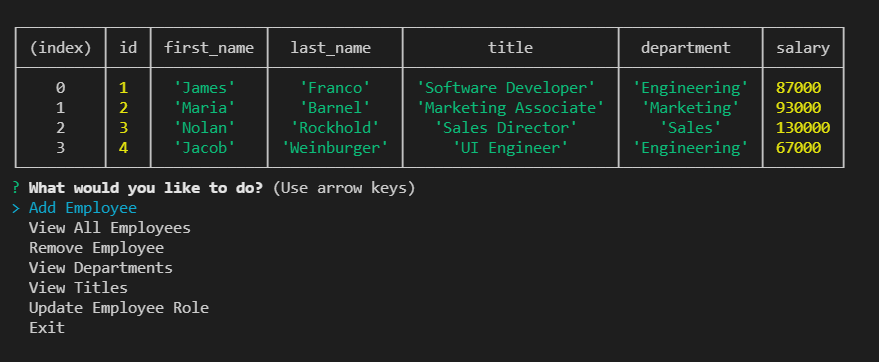

## Title
Employee Tracker
## Table of Contents
[Title](#title)

[Description](#description)

[Installation](#installation)

[Usage](#usage)

[Test](#test)

[License](#license)

## Description
This project was built using node.js, the inquirer package, and mysql
## Installation
clone this repo, run npm install to install the neccessary dependenices.
# Usage
after running node (Your js file name) the user is prompted with a list options such as view all employees, view roles, view departments, etc. Traverse the application by selecting one of the options and pressing enter.
## Test
npm run start || node server.js
## Questions
if you have any additional questions, please contact me using the following links below:
Github: [https://github.com/JaredC71](https://github.com/JaredC71)
 
Email Adress: JaredColletti123@gmail.com 
## License 

